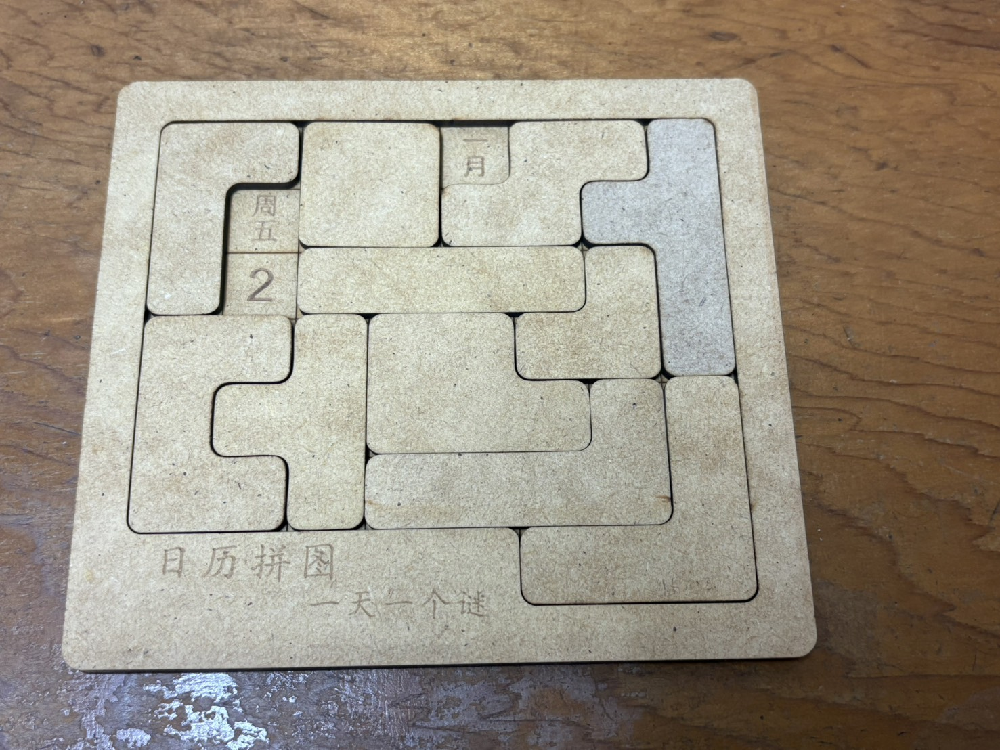
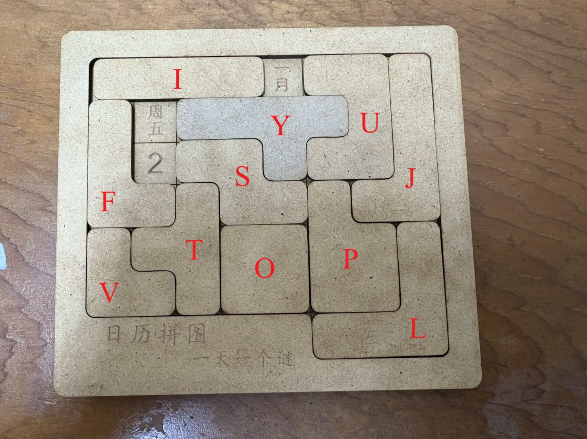

# Calendar Puzzle
<!-- TODAY-SOLUTION-START -->
## 今日解答

以 `Asia/Taipei` 為準，今天是 **8 月 18 日 周二**。

<table>
  <tbody>
    <tr>
      <td align="center">🟧</td>
      <td align="center">🟧</td>
      <td align="center">·</td>
      <td align="center">🟨</td>
      <td align="center">🟥</td>
      <td align="center">🟥</td>
      <td align="center">🟥</td>
      <td align="center">🟥</td>
    </tr>
    <tr>
      <td align="center">🟧</td>
      <td align="center">🟦</td>
      <td align="center">🟦</td>
      <td align="center">🟨</td>
      <td align="center">🟨</td>
      <td align="center">🟩</td>
      <td align="center">🟩</td>
      <td align="center">·</td>
    </tr>
    <tr>
      <td align="center">🟧</td>
      <td align="center">🟧</td>
      <td align="center">🟦</td>
      <td align="center">🟨</td>
      <td align="center">⬜</td>
      <td align="center">🟩</td>
      <td align="center">🟩</td>
      <td align="center">⬛</td>
    </tr>
    <tr>
      <td align="center">🟫</td>
      <td align="center">🟫</td>
      <td align="center">⬜</td>
      <td align="center">⬜</td>
      <td align="center">⬜</td>
      <td align="center">⬜</td>
      <td align="center">⬛</td>
      <td align="center">⬛</td>
    </tr>
    <tr>
      <td align="center">🟫</td>
      <td align="center">🟫</td>
      <td align="center">🟫</td>
      <td align="center">⚪</td>
      <td align="center">⚫</td>
      <td align="center">·</td>
      <td align="center">⬛</td>
      <td align="center">🟪</td>
    </tr>
    <tr>
      <td align="center">⚪</td>
      <td align="center">⚪</td>
      <td align="center">⚪</td>
      <td align="center">⚪</td>
      <td align="center">⚫</td>
      <td align="center">⚫</td>
      <td align="center">⚫</td>
      <td align="center">🟪</td>
    </tr>
    <tr>
      <td align="center">·</td>
      <td align="center">·</td>
      <td align="center">·</td>
      <td align="center">·</td>
      <td align="center">·</td>
      <td align="center">🟪</td>
      <td align="center">🟪</td>
      <td align="center">🟪</td>
    </tr>
  </tbody>
</table>

_此區塊由 `update_readme.py` 自動更新。_
<!-- TODAY-SOLUTION-END -->

這個專案把實體的「日曆拼圖」轉成可用程式求解的版本。給定一個月份、日期與星期後，程式會保留對應的三個格子，並嘗試用其餘所有拼塊完整覆蓋棋盤，找出合法拼法或統計解的數量。

## 專案展示

### 原始拼圖



### 拼塊標記示意



上圖中的紅色字母對應程式中的拼塊名稱：`I`、`U`、`Y`、`J`、`F`、`S`、`T`、`O`、`P`、`V`、`L`。

## 拼圖規則與棋盤模型

- 棋盤大小為 `7 x 8`。
- 左下角有缺口，因此不是完整矩形。
- 棋盤上會留下三個空格，分別代表月份、日期、星期。
- 其餘位置必須由所有拼塊完整覆蓋，不能重疊，也不能超出邊界。

在 `calendar_puzzle.py` 中，棋盤以座標集合表示，並先扣掉指定的月份、日期、星期位置，再對剩餘格位做求解。

## 演算法說明

這份程式將問題建模為 Exact Cover，並使用 DLX（Dancing Links）搜尋所有合法解。

程式流程大致如下：

1. 定義棋盤與所有拼塊形狀。
2. 為每個拼塊產生所有旋轉與鏡射變形。
3. 列舉每個拼塊在目前棋盤上的所有合法擺法。
4. 把「格子必須被覆蓋」與「每個拼塊只能使用一次」整理成 Exact Cover 矩陣。
5. 用 DLX 搜尋解答，依使用者選擇輸出拼法或解的總數。

## 演算法概念

這個問題的核心是：在固定保留三個目標格子的前提下，是否能用每個拼塊恰好一次，完整覆蓋剩餘棋盤。這很適合轉成 Exact Cover 問題：

- 每一個剩餘棋盤格都必須被覆蓋一次。
- 每一個拼塊都必須且只能被使用一次。
- 每一列候選方案代表某個拼塊的一種合法擺放方式。
- 若某列被選入解，就同時表示這個拼塊已被使用，且這個擺法覆蓋到的所有格子都已被覆蓋。

因此，整個求解流程不是直接在棋盤上暴力嘗試所有排列，而是先把所有合法擺法整理成 0/1 矩陣，再交給 DLX 做高效率回溯搜尋。

## 時間複雜度分析

這個問題本質上屬於組合搜尋問題，最壞情況下時間複雜度仍然是指數級。

### 1. 產生候選擺法

對每個拼塊，程式會：

- 產生所有旋轉
- 產生鏡射後的變形
- 枚舉它在棋盤上的所有平移位置
- 過濾掉超出邊界或碰到保留空格的擺法

若拼塊數量為 `P`，每個拼塊的平均變形數量為 `V`，每種變形可嘗試的位置數量平均為 `B`，則這一段大致可寫成：

```text
O(P x V x B)
```

在這個專案中，`P` 固定為 11 塊，棋盤大小也固定為 `7 x 8`，所以前處理成本在實務上是可控的。

### 2. DLX 搜尋解

建立 Exact Cover 矩陣後，DLX 會在候選列之間做回溯搜尋。若候選擺法總數為 `N`，則最壞情況仍可視為指數級：

```text
O(exponential in N)
```

實際執行時間主要取決於：

- 指定日期後，剩餘棋盤的限制是否夠強
- 每個拼塊可用擺法數量是否夠少
- 搜尋過程中能否及早剪枝

雖然理論上的最壞時間很高，但 DLX 透過優先選擇候選最少的欄位、以及高效率的 cover / uncover 操作，通常能在固定大小的日曆拼圖上得到不錯的實務效能。

## 使用方式

目前專案的主要入口是 [calendar_puzzle.py](./calendar_puzzle.py)。

### 執行需求

- Python 3.9 以上
- 終端機或命令列環境

### 執行方式

```bash
python calendar_puzzle.py
```

也可以直接帶參數執行：

```bash
python calendar_puzzle.py --month 1 --day 25 --weekday 0 --mode 1 --max-solutions 1
```

### 輸入參數

執行程式後，會依序要求輸入：

- 月份：`1 ~ 12`
- 日期：`1 ~ 31`
- 星期：`0 ~ 6`
  - `0 = 周日`
  - `1 = 周一`
  - `2 = 周二`
  - `3 = 周三`
  - `4 = 周四`
  - `5 = 周五`
  - `6 = 周六`
- 模式：
  - `1 = 列出解法`
  - `2 = 計算解數量`

若選擇模式 `1`，程式還會再要求輸入想要列出的最大解數量。

## 自動更新 README

專案內含：

- `update_readme.py`
- `.github/workflows/update-readme.yml`

這套流程會：

1. 以 `Asia/Taipei` 時區取得今天日期。
2. 自動求出今天的第一組解。
3. 更新 README 最上方的「今日解答」區塊。
4. 由 GitHub Actions 每天自動 commit 回 repository。

注意：README 是靜態頁面，因此它會依「工作流程設定的時區」更新，而不是依每位讀者自己的本地時區即時變化。

### 今日解答符號對照

- `🟥 = I`
- `🟧 = U`
- `🟨 = T`
- `🟩 = O`
- `🟦 = V`
- `🟪 = L`
- `🟫 = P`
- `⬛ = S`
- `⬜ = Y`
- `⚫ = F`
- `⚪ = J`
- `· = 保留給月份 / 日期 / 星期的空格`

## 範例輸出

其中一組範例輸入為：

- 月份：`1`
- 日期：`25`
- 星期：`0`（周日）
- 模式：`1`
- 想要列出的解數量：`1`

對應輸出如下：

```text
=== 解 1 ===
I I I I * O O L
V V U * U O O L
T V U U U L L L
T T P P J J J J
T Y P P P S S J
Y Y Y Y * F S S
* * * * * F F F
```

其中 `*` 代表保留給月份、日期、星期的空格，其餘字母代表各拼塊在棋盤上的擺放位置。

## 檔案結構

```text
calendarPuzzle/
├─ .github/
│  └─ workflows/
│     └─ update-readme.yml
├─ calendar_puzzle.ipynb
├─ calendar_puzzle.py
├─ update_readme.py
├─ S__9945091_0.jpg
├─ S__9945092_0.jpg
└─ README.md
```
